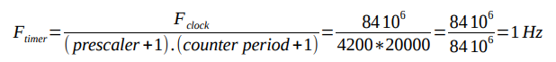
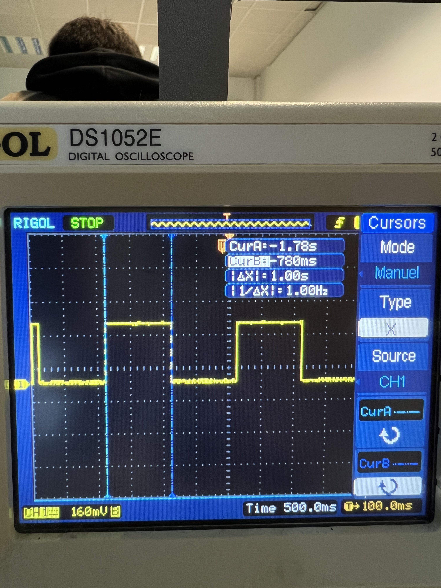
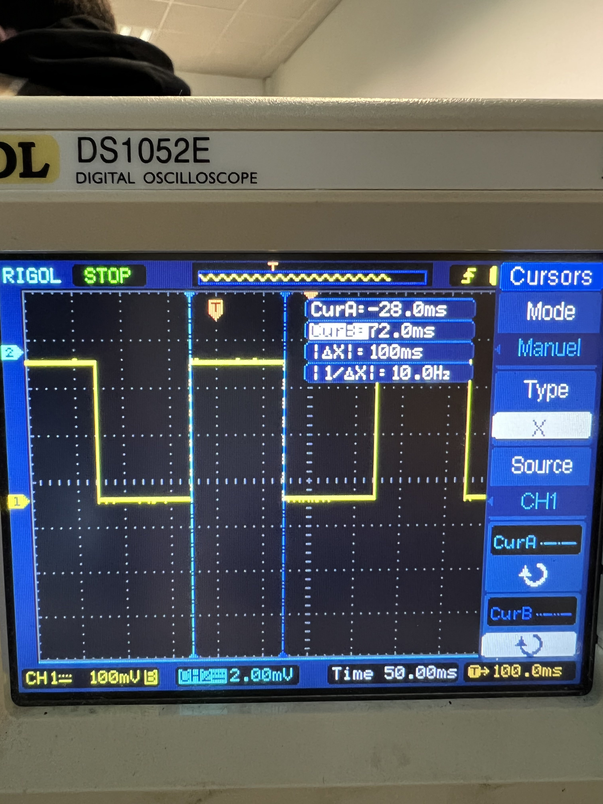
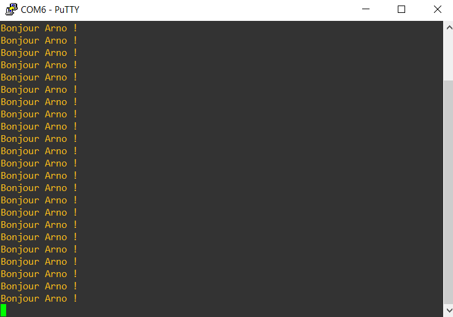
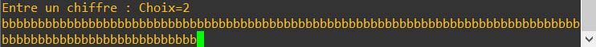

# Compte rendu Cours IOT

## Sommaire

- [Compte rendu Cours IOT](#compte-rendu-cours-iot)
	- [Sommaire](#sommaire)
	- [TP1: Découvertes des Leds et les 5 modes](#tp1-découvertes-des-leds-et-les-5-modes)
	- [TP2: Découverte des timers et compteur avec le timer](#tp2-découverte-des-timers-et-compteur-avec-le-timer)
		- [Timer 1 (Timer 6 - 1hz):](#timer-1-timer-6---1hz)
		- [Timer 2 (Timer 7 - 10hz):](#timer-2-timer-7---10hz)
	- [TP3 : Ports série](#tp3--ports-série)
	- [TP4: Servomoteurs 180°](#tp4-servomoteurs-180)
	- [TP5: ADC (Analogic Decimal Converter)](#tp5-adc-analogic-decimal-converter)
	- [TP6: DAC (decimal analogic converter)](#tp6-dac-decimal-analogic-converter)

## TP1: Découvertes des Leds et les 5 modes

Pour ce TP nous apprenions à utiliser les LEDS, on devait à l'aide du bouton de la carte basculer entre 5 modes qui font clignoter les leds de manière différentes.

Les modes:

- 1: Rien ne se passe
- 2: Les LEDS s'allument dans le sens horaire
- 3: Les LEDS s'allument dans le sens antihoraire
- 4: Les LEDS clignotent
- 5: Les LEDS s'allument une par une jusqu'à ce qu'elles soient toutes allumées pour se reéteindre et recommencer le cycle

Voici le code principal :

```c
GPIO_TypeDef* ports[4] = {LD6_BLEU_GPIO_Port, LD5_ROUGE_GPIO_Port, LD3_ORANGE_GPIO_Port, LD4_VERT_GPIO_Port};
	uint16_t pins[4] = {LD6_BLEU_Pin, LD5_ROUGE_Pin, LD3_ORANGE_Pin, LD4_VERT_Pin};
	  int mode = 0;
	  int compteur = 0;
```

On définit ici nos tableaux de LED pour pouvoir les utiliser plus tard, on initialise une variable `mode` et une `compteur` qui permet de savoir où en est la rotation des LEDS pour les modes 1 et 2.

Ensuite dans la boucle while:

```c
 while (1)
  {
	  // si le bonton bleu est pressé
	  if(HAL_GPIO_ReadPin(B1_GPIO_Port, B1_Pin) == GPIO_PIN_SET) {
		  mode++;
		  if(mode > 4){
			  mode = 0;
		  }
		  HAL_Delay(100);
	  }
	  if (mode == 0){
		  HAL_GPIO_WritePin(ports[0], pins[0], GPIO_PIN_RESET);
		  HAL_GPIO_WritePin(ports[1], pins[1], GPIO_PIN_RESET);
		  HAL_GPIO_WritePin(ports[2], pins[2], GPIO_PIN_RESET);
		  HAL_GPIO_WritePin(ports[3], pins[3], GPIO_PIN_RESET);
		  HAL_Delay(100);
	  } else if(mode == 1) {
		  compteur--;
		  if(compteur < 0){
			  compteur = 3;
		  }
		  HAL_GPIO_WritePin(ports[compteur], pins[compteur], GPIO_PIN_SET);
		  HAL_Delay(100);
		  HAL_GPIO_WritePin(ports[compteur], pins[compteur], GPIO_PIN_RESET);
	  } else if(mode == 2) {
		  compteur++;
		  if(compteur > 3){
			  compteur = 0;
		  }
		  HAL_GPIO_WritePin(ports[compteur], pins[compteur], GPIO_PIN_SET);
		  HAL_Delay(100);
		  HAL_GPIO_WritePin(ports[compteur], pins[compteur], GPIO_PIN_RESET);
	  } else if(mode == 3){
		  HAL_GPIO_TogglePin(ports[0], pins[0]);
		  HAL_GPIO_TogglePin(ports[1], pins[1]);
		  HAL_GPIO_TogglePin(ports[2], pins[2]);
		  HAL_GPIO_TogglePin(ports[3], pins[3]);
		  HAL_Delay(100);
	  } else {
		  if(HAL_GPIO_ReadPin(ports[3],pins[3])){
			HAL_GPIO_TogglePin(ports[0],pins[0]);
			HAL_GPIO_TogglePin(ports[1],pins[1]);
			HAL_GPIO_TogglePin(ports[2],pins[2]);
			HAL_GPIO_TogglePin(ports[3],pins[3]);
		  } else if(HAL_GPIO_ReadPin(ports[0],pins[0])){
			  HAL_GPIO_TogglePin(ports[3],pins[3]);
		  } else if(HAL_GPIO_ReadPin(ports[1],pins[1])) {
			  HAL_GPIO_TogglePin(ports[0],pins[0]);
		  } else if(HAL_GPIO_ReadPin(ports[2],pins[2])){
			  HAL_GPIO_TogglePin(ports[1],pins[1]);
		  } else {
			  HAL_GPIO_TogglePin(ports[2],pins[2]);
		  }
		  HAL_Delay(250);
	  }
    /* USER CODE END WHILE */
    MX_USB_HOST_Process();

    /* USER CODE BEGIN 3 */
  }
```

## TP2: Découverte des timers et compteur avec le timer

La fréquence des ticks du microcontrolleur est de **84 MHz**.

Dans ce TP nous voulons créer 2 timers :

- Un qui se répetera avec une fréquence de **1hz**,
- L'autre avec un fréquence de **10hz**.

Pour créer un timer avec la bonne fréquence il faut le configurer avec l'équation suivante :



On rajoute quelques lignes dans le `main.c` pour dire au microcontrolleur d'activer les timers (dans notre cas 6 et 7) :

```c
  HAL_TIM_Base_Start_IT(&htim6);
  HAL_TIM_Base_Start_IT(&htim7);
```

### Timer 1 (Timer 6 - 1hz):

```c
void TIM6_DAC_IRQHandler(void)
{
  /* USER CODE BEGIN TIM6_DAC_IRQn 0 */
	HAL_GPIO_TogglePin(LD4_VERT_GPIO_Port, LD4_VERT_Pin);
	if(compteur > 9){
		HAL_GPIO_TogglePin(LD6_BLEU_GPIO_Port, LD6_BLEU_Pin);
		compteur = 0;
	}
	compteur++;
  /* USER CODE END TIM6_DAC_IRQn 0 */
  HAL_TIM_IRQHandler(&htim6);
  /* USER CODE BEGIN TIM6_DAC_IRQn 1 */

  /* USER CODE END TIM6_DAC_IRQn 1 */
}
```



### Timer 2 (Timer 7 - 10hz):

```c
void TIM7_IRQHandler(void)
{
  /* USER CODE BEGIN TIM7_IRQn 0 */
	HAL_GPIO_TogglePin(LD5_ROUGE_GPIO_Port, LD5_ROUGE_Pin);

  /* USER CODE END TIM7_IRQn 0 */
  HAL_TIM_IRQHandler(&htim7);
  /* USER CODE BEGIN TIM7_IRQn 1 */

  /* USER CODE END TIM7_IRQn 1 */
}
```



## TP3 : Ports série

Dans ce tp nous devions communiquer avec un ordinateur grâce au port série.

Lorsque l'on branche le microcontroleur à l'ordinateur, dans le gestionnaire de périphériques nous pouvons voir à quel port série la carte a été attribuée, dans mon cas le port COM6 :

**Paramètres putty :**

```
serial port: COM6
speed: 115200
parity: none
flowcontrol: none
```

Ensuite le code:

```c
/* USER CODE BEGIN PFP */
void ecris_char(uint8_t car);
void ecris_txt(uint8_t *txt);
void lis_txt(char *txt);
/* USER CODE END PFP */
```

On initialise les fonctions :

```c
/* USER CODE BEGIN 4 */
void ecris_char(uint8_t car){
 HAL_UART_Transmit(&huart2,&car,1,1000);
}
void ecris_txt(uint8_t *txt){
 int i;
 for(i=0;i<strlen(txt);i++) {
 ecris_char(txt[i]);
 }
}
void lis_txt(char *txt) {
txt[0]='\0';
while(!txt[0])
HAL_UART_Receive(&huart2, txt, 1, 1000);
}
/* USER CODE END 4 *
```

On définit les fonctions :

```c
int main(void)
{
 /* USER CODE BEGIN 1 */
 char buffer[20]="Bonjour Arno !\n\r";
 /* USER CODE END 1 */
 …
 /* USER CODE BEGIN 2 */
 ecris_txt(buffer);
 /* USER CODE END 2 */
 /* Infinite loop */
 /* USER CODE BEGIN WHILE */
 while (1)
 {
 char reponse, retour[20];
 ecris_txt("Entre un chiffre : ");
 lis_txt(&reponse);
 sprintf(retour, "Choix=%c\n\r",reponse);
 ecris_txt(retour);
 /* USER CODE END WHILE */
 /* USER CODE BEGIN 3 */
 }
 /* USER CODE END 3 */
}
```

On utilise la variable `buffer` pour tester la réception, dans notre premier test on l'imprimait dans la boucle while :



Dans le deuxième en essayant le code ci-dessus nous avons eu un problème qui faisait que le microcontrolleur ne nous renvoyait que le caractère "b":



## TP4: Servomoteurs 180°

à une valeur du PwM il a un angle donné

relation duty val:
duty = val\*5 + 50

## TP5: ADC (Analogic Decimal Converter)

Le but de ce TP était de convertir l'inclinaison d'un potentiomètre en une valeur décimale.

Pour cela il nous suffit de lancer la lecture de la valeur en début de boucle et de l'afficher comme dans le TP 3 avec les ports serie.

Dans notre boucle while:

```c
	while (1)
	{
		HAL_ADC_Start(&hadc1);
		HAL_ADC_PollForConversion(&hadc1, 100);
		adcData = HAL_ADC_GetValue(&hadc1);
		HAL_ADC_Stop(&hadc1);
		if(!proche(adcData, oldVal)){
			volt= adcData*0.733;
			// c'est vraiment une méthode de pouilleux
			percent = 100*adcData/4095;
			mil = volt/1000;
			cent = (volt-(mil*1000))/100;
			diz = (volt-(mil*1000+cent*100))/10;
			un = volt-(mil*1000+cent*100+diz*10);
			sprintf(txt, "valeur ADC = %X -> pourc = %d%% -> V = %d.%d%d%d Volts\n\r", adcData, percent, mil,cent,diz,un);
			ecris_txt(txt);
			oldVal = adcData;
		}
		HAL_Delay(500);
		/* USER CODE END WHILE */
		MX_USB_HOST_Process();

		/* USER CODE BEGIN 3 */
	}
```

## TP6: DAC (decimal analogic converter)

Cube : DAC(PA4) : enlever les autres periphériques

Timer6 fréquence : 22 000 Hz

**Projet :**

Dans le `main` :

- Démarer le DAC
- Démarer le Timer

Code du 1 :

```c
/* USER CODE BEGIN Header */
/**
 ******************************************************************************
 * @file           : main.c
 * @brief          : Main program body
 ******************************************************************************
 * @attention
 *
 * Copyright (c) 2022 STMicroelectronics.
 * All rights reserved.
 *
 * This software is licensed under terms that can be found in the LICENSE file
 * in the root directory of this software component.
 * If no LICENSE file comes with this software, it is provided AS-IS.
 *
 ******************************************************************************
 */
/* USER CODE END Header */
/* Includes ------------------------------------------------------------------*/
#include "main.h"
#include "dac.h"
#include "i2c.h"
#include "spi.h"
#include "tim.h"
#include "usb_host.h"
#include "gpio.h"

/* Private includes ----------------------------------------------------------*/
/* USER CODE BEGIN Includes */

/* USER CODE END Includes */

/* Private typedef -----------------------------------------------------------*/
/* USER CODE BEGIN PTD */

/* USER CODE END PTD */

/* Private define ------------------------------------------------------------*/
/* USER CODE BEGIN PD */
/* USER CODE END PD */

/* Private macro -------------------------------------------------------------*/
/* USER CODE BEGIN PM */

/* USER CODE END PM */

/* Private variables ---------------------------------------------------------*/

/* USER CODE BEGIN PV */

/* USER CODE END PV */

/* Private function prototypes -----------------------------------------------*/
void SystemClock_Config(void);
void MX_USB_HOST_Process(void);

/* USER CODE BEGIN PFP */

/* USER CODE END PFP */

/* Private user code ---------------------------------------------------------*/
/* USER CODE BEGIN 0 */

/* USER CODE END 0 */

/**
 * @brief  The application entry point.
 * @retval int
 */
int main(void)
{
	/* USER CODE BEGIN 1 */

	/* USER CODE END 1 */

	/* MCU Configuration--------------------------------------------------------*/

	/* Reset of all peripherals, Initializes the Flash interface and the Systick. */
	HAL_Init();

	/* USER CODE BEGIN Init */

	/* USER CODE END Init */

	/* Configure the system clock */
	SystemClock_Config();

	/* USER CODE BEGIN SysInit */

	/* USER CODE END SysInit */

	/* Initialize all configured peripherals */
	MX_GPIO_Init();
	MX_I2C1_Init();
	MX_SPI1_Init();
	MX_USB_HOST_Init();
	MX_DAC_Init();
	MX_TIM6_Init();
	/* USER CODE BEGIN 2 */
	HAL_DAC_Start(&hdac, DAC1_CHANNEL_1);
	/* USER CODE END 2 */

	/* Infinite loop */
	/* USER CODE BEGIN WHILE */
	while (1)
	{
		HAL_DAC_SetValue(&hdac, DAC_CHANNEL_1,DAC_ALIGN_12B_L,1241);
		HAL_Delay(200);
		HAL_DAC_SetValue(&hdac, DAC_CHANNEL_1,DAC_ALIGN_12B_L,2482);
		HAL_Delay(200);
		/* USER CODE END WHILE */
		MX_USB_HOST_Process();

		/* USER CODE BEGIN 3 */
	}
	/* USER CODE END 3 */
}

/**
 * @brief System Clock Configuration
 * @retval None
 */
void SystemClock_Config(void)
{
	RCC_OscInitTypeDef RCC_OscInitStruct = {0};
	RCC_ClkInitTypeDef RCC_ClkInitStruct = {0};

	/** Configure the main internal regulator output voltage
	 */
	__HAL_RCC_PWR_CLK_ENABLE();
	__HAL_PWR_VOLTAGESCALING_CONFIG(PWR_REGULATOR_VOLTAGE_SCALE1);
	/** Initializes the RCC Oscillators according to the specified parameters
	 * in the RCC_OscInitTypeDef structure.
	 */
	RCC_OscInitStruct.OscillatorType = RCC_OSCILLATORTYPE_HSE;
	RCC_OscInitStruct.HSEState = RCC_HSE_ON;
	RCC_OscInitStruct.PLL.PLLState = RCC_PLL_ON;
	RCC_OscInitStruct.PLL.PLLSource = RCC_PLLSOURCE_HSE;
	RCC_OscInitStruct.PLL.PLLM = 8;
	RCC_OscInitStruct.PLL.PLLN = 336;
	RCC_OscInitStruct.PLL.PLLP = RCC_PLLP_DIV2;
	RCC_OscInitStruct.PLL.PLLQ = 7;
	if (HAL_RCC_OscConfig(&RCC_OscInitStruct) != HAL_OK)
	{
		Error_Handler();
	}
	/** Initializes the CPU, AHB and APB buses clocks
	 */
	RCC_ClkInitStruct.ClockType = RCC_CLOCKTYPE_HCLK|RCC_CLOCKTYPE_SYSCLK
			|RCC_CLOCKTYPE_PCLK1|RCC_CLOCKTYPE_PCLK2;
	RCC_ClkInitStruct.SYSCLKSource = RCC_SYSCLKSOURCE_PLLCLK;
	RCC_ClkInitStruct.AHBCLKDivider = RCC_SYSCLK_DIV1;
	RCC_ClkInitStruct.APB1CLKDivider = RCC_HCLK_DIV4;
	RCC_ClkInitStruct.APB2CLKDivider = RCC_HCLK_DIV2;

	if (HAL_RCC_ClockConfig(&RCC_ClkInitStruct, FLASH_LATENCY_5) != HAL_OK)
	{
		Error_Handler();
	}
}

/* USER CODE BEGIN 4 */

/* USER CODE END 4 */

/**
 * @brief  This function is executed in case of error occurrence.
 * @retval None
 */
void Error_Handler(void)
{
	/* USER CODE BEGIN Error_Handler_Debug */
	/* User can add his own implementation to report the HAL error return state */
	__disable_irq();
	while (1)
	{
	}
	/* USER CODE END Error_Handler_Debug */
}

#ifdef  USE_FULL_ASSERT
/**
 * @brief  Reports the name of the source file and the source line number
 *         where the assert_param error has occurred.
 * @param  file: pointer to the source file name
 * @param  line: assert_param error line source number
 * @retval None
 */
void assert_failed(uint8_t *file, uint32_t line)
{
	/* USER CODE BEGIN 6 */
	/* User can add his own implementation to report the file name and line number,
     ex: printf("Wrong parameters value: file %s on line %d\r\n", file, line) */
	/* USER CODE END 6 */
}
#endif /* USE_FULL_ASSERT */

```

2eme code:

```c
void TIM6_DAC_IRQHandler(void)
{
	/* USER CODE BEGIN TIM6_DAC_IRQn 0 */
	if(compteur%50>=25){
		if(HAL_DAC_GetValue(&hdac, DAC_CHANNEL_1) != 1241){
			HAL_DAC_SetValue(&hdac, DAC_CHANNEL_1,DAC_ALIGN_12B_L,1241);
		}
	} else {
		if(HAL_DAC_GetValue(&hdac, DAC_CHANNEL_1) != 2482){
			HAL_DAC_SetValue(&hdac, DAC_CHANNEL_1,DAC_ALIGN_12B_L,2482);
		}
	}
	compteur++;
	/* USER CODE END TIM6_DAC_IRQn 0 */
	HAL_DAC_IRQHandler(&hdac);
	HAL_TIM_IRQHandler(&htim6);
	/* USER CODE BEGIN TIM6_DAC_IRQn 1 */

	/* USER CODE END TIM6_DAC_IRQn 1 */
}
```
